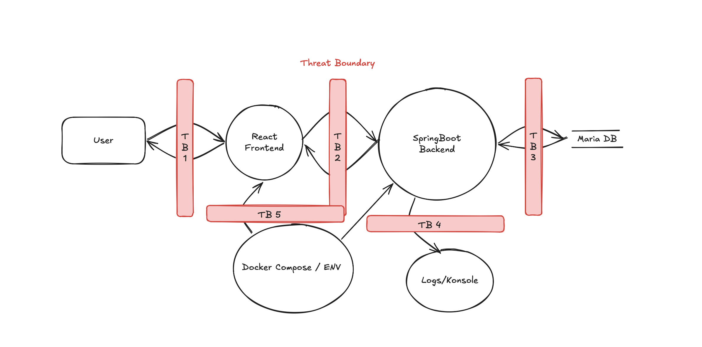
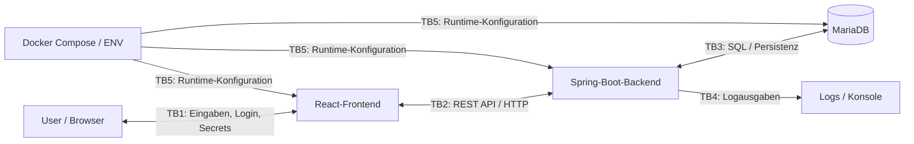

# Threat Modelling Tresor-App

Diese Abgabe dokumentiert die Threat-Analyse der Tresor-Applikation. Die Bewertung basiert auf dem bestehenden Frontend, Backend, der Datenbankanbindung und den in der Excel-Datei erfassten STRIDE-/DREAD-Einträgen.

## Applikation starten

```bash
docker compose up --build
```

Die Anwendung besteht aus:

| Komponente | Beschreibung |
|---|---|
| React-Frontend | UI für Login, Registrierung und Secret-Verwaltung |
| Spring-Boot-Backend | REST-API für Benutzer und Secrets |
| MariaDB | Persistente Speicherung von Userdaten und Secrets |
| Docker Compose | Startet Frontend, Backend und Datenbank gemeinsam |

## Data Flow Diagram

Das Data Flow Diagram ist im Repository als `Diagram.png` abgelegt.



Zusätzlich zeigt das folgende Mermaid-Diagramm die wichtigsten Prozesse, Datenspeicher und Threat Boundaries:



## Threat Boundaries

| Boundary | Übergang | Begründung |
|---|---|---|
| TB1 | User/Browser ↔ React-Frontend | Benutzer-Eingaben, Passwörter und Secret-Inhalte kommen aus einem nicht vertrauenswürdigen Client. |
| TB2 | React-Frontend ↔ Spring-Boot-Backend | REST-API-Grenze; Requests können direkt oder manipuliert an das Backend gesendet werden. |
| TB3 | Spring-Boot-Backend ↔ MariaDB | Persistente Speicherung von Userdaten und Secrets. |
| TB4 | Backend ↔ Logs/Konsole | Nebenkanal für sensible Informationen wie Passwörter, E-Mails und Secrets. |
| TB5 | Docker Compose / ENV ↔ Container | Runtime-Konfiguration, DB-Credentials, CORS und Images beeinflussen die Sicherheit. |

## STRIDE-Analyse

| ID | Boundary | STRIDE | Konkrete Bedrohung im Projekt |
|---|---|---|---|
| T01 | TB2 | Spoofing | `/api/users/login` akzeptiert einen bekannten User, ohne das Passwort korrekt zu prüfen. Dadurch kann ein Angreifer sich als beliebiger bestehender User ausgeben. |
| T02 | TB2 | Spoofing | Beim Erstellen eines Secrets wird zwar eine E-Mail verwendet, aber das Passwort wird nicht gegen das User-Passwort geprüft. Ein Angreifer kann Secrets unter fremder Identität anlegen. |
| T03 | TB2 | Spoofing | `/api/secrets/byuserid` arbeitet mit einer übergebenen `userId`. Da IDs erratbar sind, kann ein Client fremde User-IDs ausprobieren. |
| T04 | TB2 | Spoofing | Es gibt kein Session-, Token- oder serverseitiges Identitätsmodell. Die API vertraut auf frei manipulierbare JSON-Felder wie E-Mail, User-ID und Passwort. |
| T05 | TB2 | Tampering | `PUT /api/secrets/{id}` kann durch manipulierte Secret-IDs angegriffen werden; zusätzlich wurde im ursprünglichen Code ein Long-Vergleich mit `!=` verwendet. |
| T06 | TB2 | Tampering | `DELETE /api/secrets/{id}` löscht ein Secret nur anhand der ID, ohne Besitz- oder Passwortprüfung. |
| T07 | TB2 | Tampering | `updateSecret` ruft nach dem Update zusätzlich `createSecret(secret)` auf. Dadurch kann die Persistenz verfälscht werden, zum Beispiel durch doppelte oder unerwartete Datensätze. |
| T08 | TB3 | Tampering | Das Backend nutzt DB-Root-Credentials (`root/1234`). Wird das Backend kompromittiert, kann die ganze Datenbank verändert werden. |
| T09 | TB3 | Information Disclosure | Secrets liegen in der DB beziehungsweise im Initial-SQL als klar lesbare JSON-Inhalte oder nur schwach geschützt vor. Bei DB-Zugriff sind Inhalte direkt auslesbar. |
| T10 | TB4 | Repudiation | Sicherheitsrelevante Aktionen sind nicht sauber auditierbar. Es gibt viele `System.out.println`, aber keine verlässliche Security-Audit-Spur. |
| T11 | TB4 | Repudiation | Fehlgeschlagene Loginversuche werden nicht strukturiert als Security Events erfasst. Angriffe sind dadurch schwer nachvollziehbar. |
| T12 | TB2/TB4 | Information Disclosure | DTOs wie Login- oder Secret-Requests werden über `toString` oder `println` geloggt. Dadurch können Passwörter und Secret-Inhalte in Logs landen. |
| T13 | TB2 | Information Disclosure | `GET /api/users` gibt alle Benutzer zurück, inklusive Passwortfeld. |
| T14 | TB2 | Information Disclosure | `GET /api/users/{id}` gibt einen einzelnen Benutzer inklusive Passwortfeld zurück. |
| T15 | TB2 | Information Disclosure | `GET /api/secrets` gibt alle Secrets aller User zurück. |
| T16 | TB2 | Information Disclosure | `/api/users/byemail` beziehungsweise `/api/secrets/byemail` erlauben E-Mail-Enumeration, weil anhand der Antwort erkennbar ist, ob ein User existiert. |
| T17 | TB1 | Information Disclosure | Das Frontend hält Login-Daten im State und gibt Login-Werte in der Browser-Konsole aus. Dadurch können Passwörter lokal sichtbar werden. |
| T18 | TB2 | Information Disclosure | In der Docker-Compose-Entwicklungsumgebung kommunizieren Frontend und Backend per HTTP statt HTTPS. Login- und Secret-Daten sind auf Transportebene nicht geschützt. |
| T19 | TB2 | Denial of Service | Login-, Registrierungs- und Secret-Endpunkte haben kein Rate Limiting. Ein Angreifer kann viele Requests senden und Backend/DB belasten. |
| T20 | TB2 | Denial of Service | Secret-Inhalte haben keine klaren Grössenlimits. Sehr grosse JSON-Payloads können Speicher, CPU oder DB belasten. |
| T21 | TB3 | Denial of Service | Bei nicht vorhandenen Secret-IDs kann unsauberes Optional-/Null-Handling Exceptions auslösen. Wiederholte Requests können Fehler erzeugen. |
| T22 | TB3 | Denial of Service | DB-Calls können `null` zurückgeben; danach werden teilweise Methoden wie `.isEmpty()` direkt aufgerufen. Das kann zu NullPointerExceptions führen. |
| T23 | TB5 | Elevation of Privilege | Das Backend verwendet DB-Root-Rechte statt eines Least-Privilege-Users. Ein Fehler im Backend wird dadurch zu einem Vollzugriff auf die DB. |
| T24 | TB2 | Elevation of Privilege | Es gibt kein Rollenmodell. Normale Clients können Admin-artige Endpunkte wie User-Liste oder Secret-Liste aufrufen. |
| T25 | TB5 | Elevation of Privilege | Docker-Images wie `latest` und ein altes Node-Image erhöhen Supply-Chain- und Runtime-Risiken, weil sich Images unerwartet ändern oder bekannte Schwachstellen enthalten können. |
| T26 | TB2 | Tampering / Information Disclosure | CORS ist zwar auf eine Origin konfiguriert, aber die Backend-API ist direkt auf Port 8080 erreichbar. CORS ersetzt keine serverseitige Authentisierung oder Autorisierung. |

## DREAD-Bewertung

Skala: 0 = sehr tief, 10 = sehr hoch. Total = Damage + Reproducibility + Exploitability + Affected Users + Discoverability. Maximum: 50 Punkte.

| ID | Kurzbeschreibung | Damage | Reprod. | Exploit. | Users | Discover. | Total | Priorität |
|---|---:|---:|---:|---:|---:|---:|---:|---|
| T01 | Login akzeptiert jedes Passwort | 10 | 10 | 10 | 10 | 10 | 50 | Kritisch |
| T15 | Alle Secrets per GET abrufbar | 10 | 10 | 10 | 10 | 10 | 50 | Kritisch |
| T13 | Userliste inklusive Passwortfeld | 10 | 10 | 10 | 10 | 9 | 49 | Kritisch |
| T06 | Secret löschen ohne Ownership | 9 | 10 | 10 | 9 | 10 | 48 | Kritisch |
| T09 | Secrets in DB/SQL klar lesbar oder ungenügend geschützt | 10 | 9 | 8 | 10 | 9 | 46 | Kritisch |
| T02 | Secret-Erstellung ohne Passwortprüfung | 8 | 10 | 9 | 9 | 9 | 45 | Hoch |
| T03 | Zugriff über erratbare User-ID | 9 | 9 | 9 | 9 | 9 | 45 | Hoch |
| T12 | Sensible Daten in Logs | 9 | 8 | 8 | 10 | 9 | 44 | Hoch |
| T24 | Kein Rollen-/Autorisierungsmodell | 9 | 9 | 8 | 10 | 8 | 44 | Hoch |
| T14 | Einzeluser inklusive Passwortfeld abrufbar | 8 | 10 | 9 | 9 | 8 | 44 | Hoch |
| T04 | Keine Sessions oder Tokens | 8 | 8 | 8 | 10 | 8 | 42 | Hoch |
| T16 | E-Mail-Enumeration | 5 | 9 | 9 | 10 | 8 | 41 | Hoch |
| T17 | Passwort im Frontend-State und Browser-Log | 8 | 8 | 8 | 9 | 8 | 41 | Hoch |
| T19 | Kein Rate Limiting | 7 | 8 | 8 | 10 | 8 | 41 | Hoch |
| T08 | Root/1234 und breite DB-Rechte | 9 | 7 | 7 | 10 | 7 | 40 | Hoch |
| T18 | HTTP statt HTTPS | 8 | 8 | 7 | 10 | 7 | 40 | Hoch |
| T23 | DB-Root im Backend | 9 | 7 | 7 | 10 | 7 | 40 | Hoch |
| T05 | Manipulierbare Secret-ID / falscher Long-Vergleich | 8 | 8 | 7 | 8 | 8 | 39 | Hoch |
| T07 | Update persistiert potenziell doppelt oder falsch | 7 | 8 | 7 | 8 | 8 | 38 | Mittel |
| T20 | Keine Grössenlimits für JSON-Secrets | 7 | 7 | 7 | 10 | 7 | 38 | Mittel |
| T21 | Exception bei ungültiger Secret-ID | 6 | 8 | 8 | 8 | 8 | 38 | Mittel |
| T26 | API direkt erreichbar trotz CORS | 7 | 7 | 7 | 9 | 8 | 38 | Mittel |
| T25 | Ungepinnt/veraltet: latest, Node 14 | 7 | 6 | 6 | 10 | 7 | 36 | Mittel |
| T22 | Null-Handling bei DB-Fehlern | 6 | 7 | 7 | 8 | 7 | 35 | Mittel |
| T10 | Keine saubere Audit-Spur | 5 | 6 | 5 | 8 | 7 | 31 | Mittel |
| T11 | Login-Fails nicht als Security Events | 5 | 6 | 5 | 8 | 7 | 31 | Mittel |

Prioritäten:

| Priorität | Anzahl |
|---|---:|
| Kritisch | 5 |
| Hoch | 13 |
| Mittel | 8 |

## Diskussion DREAD und Risiko

Klassisches Risiko wird oft als `Impact × Likelihood` bewertet. DREAD verfolgt eine ähnliche Idee, teilt sie aber feiner auf.

`Damage Potential` und `Affected Users` beschreiben hauptsächlich den Impact: Wie gross ist der Schaden und wie viele Personen oder Daten sind betroffen? `Reproducibility`, `Exploitability` und `Discoverability` beschreiben hauptsächlich die Likelihood: Wie einfach ist der Angriff zu finden, zu wiederholen und praktisch auszunutzen?

Bei T01 ist sowohl Impact als auch Likelihood maximal: Der Login akzeptiert jedes Passwort für bekannte User, wodurch eine vollständige Kontoübernahme möglich ist. Gleichzeitig ist der Angriff sehr einfach reproduzierbar. Bei T15 ist der Impact ebenfalls sehr hoch, weil alle gespeicherten Secrets betroffen sind; die Ausnutzung ist ein direkter API-Call.

T18 zeigt eine Grenze von DREAD: HTTP statt HTTPS hat potenziell hohen Impact, die tatsächliche Likelihood hängt aber stärker von der Umgebung ab. In der lokalen Docker-Compose-Entwicklungsumgebung ist dieser Punkt weniger unmittelbar als direkte API-Fehler wie T01 oder T15.

DREAD ist additiv. Bei `Impact × Likelihood` können einzelne sehr hohe Impact-Werte stärker ins Gewicht fallen. Die Tabelle ist deshalb eine nachvollziehbare Priorisierung, aber keine absolute Wahrheit.

## Top-10 Mitigations mit OWASP-Bezug

| Rang | Threat | DREAD | Mitigation | OWASP-Top-10-Bezug | Diskussion |
|---:|---|---:|---|---|---|
| 1 | T01 – Login akzeptiert jedes Passwort | 50 | Passwortprüfung im Backend erzwingen. Passwörter nie im Klartext vergleichen, sondern mit BCrypt hashen und mit `matches()` prüfen. Bei falschem Passwort `401 Unauthorized` zurückgeben. | A07 Identification and Authentication Failures | Die Authentisierung ist fehlerhaft oder unvollständig. |
| 2 | T15 – Alle Secrets per GET abrufbar | 50 | Globalen Endpunkt `GET /api/secrets` entfernen, sperren oder nur für echte Admin-Rolle erlauben. Normale User dürfen nur eigene Secrets abrufen. | A01 Broken Access Control | User können auf Daten zugreifen, die ihnen nicht gehören. |
| 3 | T13 – Userliste inklusive Passwortfeld | 49 | Für User-Antworten ein Response-DTO ohne Passwortfeld verwenden. Zusätzlich Userlisten nur authentisiert und rollenbasiert freigeben. | A01 Broken Access Control / A02 Cryptographic Failures | Sensible Authentisierungsdaten werden offengelegt und Endpunkte sind nicht korrekt geschützt. |
| 4 | T06 – Secret löschen ohne Ownership | 48 | Vor dem Löschen Secret laden, User authentisieren und prüfen, ob `secret.userId` zur authentisierten Identität gehört. Erst danach löschen. | A01 Broken Access Control | Eine Objekt-ID kann manipuliert werden und fremde Ressourcen können gelöscht werden. |
| 5 | T09 – Secrets in DB/SQL klar lesbar oder ungenügend geschützt | 46 | Secret-Inhalte vor dem Speichern verschlüsseln. Verschlüsselungsschlüssel nicht fest im Code speichern. Bestehende Klartext-Testdaten entfernen oder migrieren. | A02 Cryptographic Failures | Sensible Daten werden unzureichend geschützt gespeichert. |
| 6 | T02 – Secret-Erstellung ohne Passwortprüfung | 45 | Beim Erstellen eines Secrets zuerst User anhand E-Mail/User-ID laden und Passwort prüfen. Ohne erfolgreiche Authentisierung darf kein Secret gespeichert werden. | A07 Identification and Authentication Failures | Identität wird nur behauptet, aber nicht geprüft. |
| 7 | T03 – Zugriff über erratbare User-ID | 45 | Zugriff auf Secrets nicht allein über `userId` erlauben. User-ID muss aus einer authentisierten Session oder einem Token stammen. Zusätzlich Ownership serverseitig prüfen. | A01 Broken Access Control | Direkte Objekt-/User-ID-Manipulation ist möglich. |
| 8 | T12 – Sensible Daten in Logs | 44 | Keine Passwörter, Secret-Inhalte oder vollständige DTOs loggen. Strukturierte Logs verwenden und nur technische IDs oder generische Security Events speichern. | A09 Security Logging and Monitoring Failures / A02 Cryptographic Failures | Sensible Daten können über Logs offengelegt werden und Security Events sind ungenau. |
| 9 | T24 – Kein Rollen-/Autorisierungsmodell | 44 | Rollenmodell einführen, zum Beispiel `USER` und `ADMIN`. Admin-Endpunkte wie Userliste oder globale Secretliste nur mit Admin-Rolle freigeben. Normale User erhalten nur Zugriff auf eigene Ressourcen. | A01 Broken Access Control | Fehlende Autorisierung führt zu Rechteausweitung. |
| 10 | T14 – Einzeluser inklusive Passwortfeld abrufbar | 44 | `GET /api/users/{id}` darf kein Passwortfeld zurückgeben. Zusätzlich darf ein normaler User nur sich selbst abrufen; andere User nur mit Admin-Rolle. | A01 Broken Access Control / A02 Cryptographic Failures | Sensible Userdaten werden offengelegt und fremde Userdaten sind abrufbar. |

## Vorgeschlagene Fixes

Gemäss Aufgabenstellung soll pro Commit oder PR jeweils genau eine Bedrohung beziehungsweise eine klar abgegrenzte Gruppe eng zusammenhängender Bedrohungen eliminiert werden. Die folgenden Stories eignen sich als Arbeitsaufteilung.

| Story ID | Story / Fix | Ziel | Betroffene Threat IDs | DREAD-Begründung | Konkrete Umsetzung | Acceptance Criteria | OWASP Top 10 Bezug | Owner |
|---|---|---|---|---|---|---|---|---|
| S1 | Login im Backend implementieren | Authentisierung muss serverseitig korrekt durchgesetzt werden. | T01, T04 | T01 hat DREAD 50/50: Login mit beliebigem Passwort ermöglicht vollständige Kontoübernahme. T04 ist hoch, weil die API aktuell auf manipulierbare Client-Daten vertraut. | Login-Service/Controller so anpassen, dass User anhand E-Mail geladen und das Passwort mit einem sicheren Hash geprüft wird. Bei falschen Daten immer 401 zurückgeben. | Bekannter User mit falschem Passwort wird abgelehnt; bekannter User mit richtigem Passwort wird akzeptiert; unbekannter User wird abgelehnt; keine Auth-Entscheidung im Frontend. | A07 Identification and Authentication Failures; A01 Broken Access Control | Jessica |
| S2 | Ownership überprüfen | Secrets dürfen nur vom Besitzer gelesen, geändert oder gelöscht werden. | T03, T05, T06, T15 | T15 hat DREAD 50/50 und T06 48/50: fremde Secrets können gelesen oder gelöscht werden. Erratbare IDs und fehlende Ownership-Prüfung machen den Angriff einfach reproduzierbar. | Bei Secret-Read/Update/Delete zuerst authentifizierten User bestimmen, Secret laden und serverseitig prüfen, ob `Secret.owner == User`. Globale Secret-Liste sperren oder auf Admin beschränken. | User A kann eigene Secrets lesen/ändern/löschen; User A kann Secret von User B nicht lesen/ändern/löschen; direkte API-Requests mit fremder Secret-ID geben 403 oder 404 zurück. | A01 Broken Access Control; A04 Insecure Design | Roman |
| S3 | Password Handling: Hashing, nicht loggen, keine Exposure | Passwörter dürfen nie im Klartext gespeichert, geloggt oder über API-Antworten ausgegeben werden. | T09, T12, T13, T14, T17 | T13 und T14 sind hoch priorisiert, weil Passwortfelder über API sichtbar sind. T12 ist hoch, weil sensible Daten über Logs weitergegeben werden können. T09 betrifft vertrauliche Speicherung. | BCrypt für Passwortspeicherung verwenden, User-Response-DTOs ohne Passwortfeld einführen, sensible `println`-/`toString`-Logs entfernen, Frontend-Console-Logs von Login-Daten löschen und Passwortfelder als `password` inputs führen. | DB enthält keine Klartextpasswörter; API-Antworten enthalten kein Passwortfeld; Logs enthalten keine Passwörter/Secrets; Login funktioniert weiterhin mit gehashten Passwörtern. | A02 Cryptographic Failures; A07 Identification and Authentication Failures; A09 Security Logging and Monitoring Failures | Jannik |
| S4 | UUID verwenden, um erratbare User-ID zu vermeiden | User- und/oder Secret-Referenzen sollen nicht durch fortlaufende IDs einfach erratbar sein. | T03, T05, T26 | T03 hat DREAD 45/50: Zugriff über erratbare User-ID ist einfach auszuprobieren. UUIDs reduzieren Enumeration, ersetzen aber keine Ownership-Prüfung. | Public IDs als UUID einführen, zum Beispiel `userUuid` und `secretUuid`. API verwendet UUIDs statt fortlaufender Datenbank-IDs. Interne DB-IDs bleiben optional intern und werden nicht an Clients geleakt. | Neue User/Secrets erhalten UUIDs; API-Endpunkte akzeptieren UUIDs; fortlaufende interne IDs werden nicht im Frontend oder in API-Antworten verwendet; Ownership-Prüfungen bleiben aktiv. | A01 Broken Access Control; A05 Security Misconfiguration | Lou |

## Priorisierte Umsetzung

Am sinnvollsten ist zuerst S1, weil T01 mit 50/50 den höchsten DREAD-Wert hat und direkt Account-Übernahme ermöglicht. Danach folgt S2, weil T15 und T06 den Zugriff auf fremde Secrets beziehungsweise deren Löschung betreffen. S3 reduziert die Offenlegung von Passwörtern und sensiblen Daten über API, Datenbank und Logs. S4 verbessert die Robustheit gegen Enumeration, ersetzt aber keine serverseitige Autorisierung.
